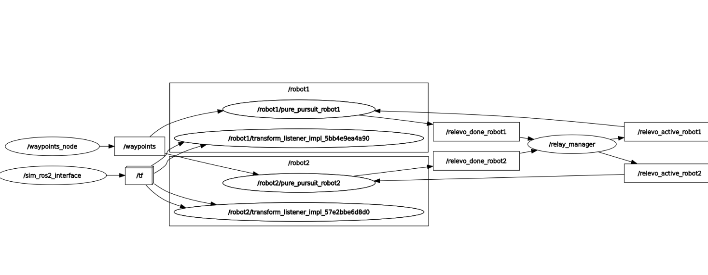

# Lucía Pardo Pérez - Robotics & Software Portfolio

Hi! I am an Informatics and Robotics Engineer currently based in Amsterdam. I specialize in bridging the gap between smart software (Python, ROS2, Flutter) and physical hardware. 

---

## 🦾 Key Projects

### 1. UR10e Robotic Arm: Pick & Place Industrial Cell
* **Technologies:** Onshape (3D CAD), Universal Robots, Trajectory Optimization, Gripper Design.
* **Description:** Designed and programmed an automated industrial cell. I used **Onshape** to model and 3D-print custom mechanical grippers and fixtures to sort and place components in different layouts.
* **Project Media:** 

### 2. Multi-Robot Relay Race Simulation (ROS2 & CoppeliaSim)
* **Technologies:** Python, ROS2 (Humble), CoppeliaSim, Pure Pursuit Algorithm, TF2, YAML Configurations.

#### **Project Overview**
Developed and simulated a cooperative relay race between two autonomous mobile robots using the **Turtlebot3 (Burger)** model in a virtual environment. The core challenge was to implement an automated coordination logic where the first robot follows a predefined path, stops at the final waypoint, and triggers the second robot to execute the same path.

#### **Key Technical Contributions**
* **Path Tracking Control:** Implemented trajectory control based on the `cmd_vel` and `odom` topics using a **Pure Pursuit** controller in Python.
* **Multi-Robot Architecture & Namespacing:** Duplicated and configured robot models in **CoppeliaSim**. Avoided topic collision by designing an isolated multi-robot ROS2 launch framework using distinct namespaces (`/robot1` and `/robot2`).
* **Topic Remapping & Coordination:** Designed custom remappings for odometry and velocity commands (`/odom1`, `/cmd_vel1`, etc.) and integrated a **Relay Manager Node** (`relay_manager`) to synchronize state transitions through dedicated coordination topics.
* **Dynamic Waypoint Configuration:** Created a dedicated waypoint publisher node (`waypoints_node`) that dynamically parses spatial path coordinates from a `path.yaml` file and streams them to the architecture.

#### **System Architecture Graph (rqt_graph)**
The system computation graph below showcases the nodes, topics, and multi-robot communication pipeline designed for this synchronization task. Click on the image or the button below to view the full configuration:

---

#### **Project Documentation & Media**
Inside this repository, you can find the complete engineering breakdown of the setup, namespacing logic, and ROS2 node coordination:

---

### 3. "Through the Door" - AR Measurement App
* **Technologies:** Flutter, Dart, Android Studio, GitLab.
* **Description:** Mobile application developed during my semester at HvA (Amsterdam) inside the Social Impact Apps studio, focusing on clean user interfaces and agile workflow integration.

---

## 🛠️ Skills & Tech Stack
* **Languages:** Python, C++, SQL, Dart, Kotlin.
* **Frameworks & Tools:** ROS2, Flutter, Android Studio, Onshape, Git/GitLab.

## 📬 Contact Me
* **LinkedIn:** [Your LinkedIn Link Here]
* **Email:** pardoperezlucia@gmail.com
